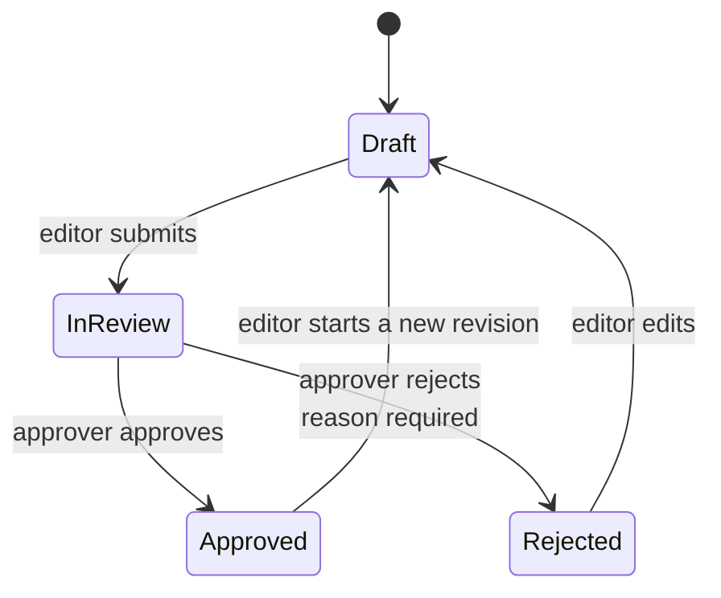

# Approval workflow

Every content change by an HR, News or Marketing Admin goes through review.
Super Admin changes publish directly. Rejection always requires a reason.

## The rules

- **An already-published item stays online while its replacement is reviewed.**
  Editing a published item creates a new draft revision; the live version is
  untouched until the revision is approved.
- **An item in review is locked.** Its editor cannot change it until the
  Approver has decided, so the Approver never reviews a moving target.
- **Rejection requires a reason**, and the editor sees it on the item.
- **Delete and unpublish are requests too.** The item stays live until approved.
- **Revision history is kept** — up to 25 versions per item, with who changed
  what and when.

## Where it is enforced

In `src/hooks/approval.ts`, as a database-level hook rather than in the
interface, because the REST and GraphQL APIs reach the same data. The hook
refuses, with a readable message:

- an editor trying to approve their own work
- an approver trying to edit content instead of deciding on it
- a decision on an item that was never submitted
- a rejection with no reason
- any change to an item currently in review

## For the Approver

Filter any list by **Approval Status = In Review** to see what is waiting. Open
an item, read it in both languages using the locale switcher, then set Approval
Status to Approved or Rejected and save. A rejection needs the reason field
filled in; the editor sees it when they reopen the item.

## What is recorded

Every submission, approval, rejection, publish and deletion is written to the
**Audit Log** under Pengaturan, with the user, the item and the reason. The log
is readable by Super Admin and cannot be edited or deleted by anyone.
