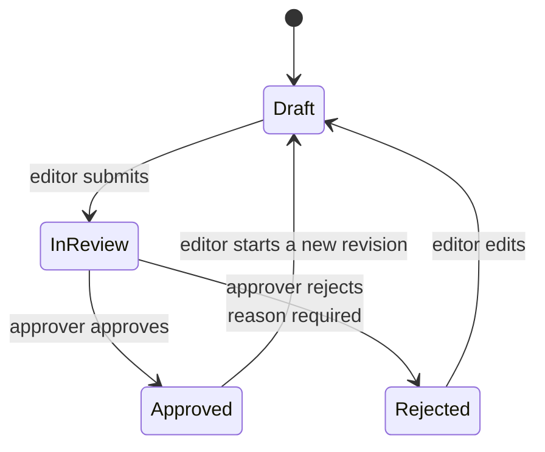

# Approval workflow

Three statuses, and only one of them is on the website.

| Status | Meaning | Public site |
| --- | --- | --- |
| **In Review** | Submitted, waiting for a decision | No |
| **Approved** | Signed off | **Yes — live** |
| **Rejected** | Sent back, reason required | No |

There is no Draft. Saving is what submits an item, so Draft was never a state
anyone chose — and an item in Draft could not be approved either, because the
Approver may only decide on something in review. It was a dead end as well as
a dead state. Work in progress is simply an item in review that nobody has
decided on yet, and its author can keep editing it until they do.

## Who moves what

| Role | On save | Can set |
| --- | --- | --- |
| HR / News / Marketing Admin | In Review, always | nothing — there is no status control on their form |
| Approver | — | Approved, Rejected (reason required), and only on an item in review |
| Super Admin | In Review by default | any status, including Approved in the same save that creates the item |

An editor sees where their work stands as a read-only pill, not a control.

## Editing settled work

Anything approved or rejected goes back to **In Review** the moment it is
saved, whoever saves it — editor, Approver or Super Admin. An approved page
therefore leaves the website while its edit is in review, and returns when it
is approved again.

This is deliberate and differs from the original note in `intent/03-cms.md`,
which had the live version stay online until a revision was approved. Nothing
unreviewed reaches a reader; the cost is that correcting a typo takes the
page down until someone approves it. A Super Admin can do both in one step by
setting the status to Approved before saving, which counts as a decision
because the value changes.

The admin form posts back whatever the status field is showing, so an
unchanged value is not a choice. Reading it as one is what once left a
rejected item rejected however often it was saved, and refused an editor's
save outright on anything rejected or approved.

## Locking

An item in review is locked to everyone except the person who submitted it.
The Approver is not reading a moving target, and an author is not locked out
of their own half-written piece by their first save.

---

## Original notes

Every content change by an HR, News or Marketing Admin goes through review.
Super Admin changes publish directly. Rejection always requires a reason.

```mermaid
stateDiagram-v2
  [*] --> Draft
  Draft --> InReview: editor submits
  InReview --> Approved: approver approves
  InReview --> Rejected: approver rejects<br/>reason required
  Rejected --> Draft: editor edits
  Approved --> Draft: editor starts a new revision
```

## The rules

- **An already-published item stays online while its replacement is reviewed.**
  Editing a published item creates a new draft revision; the live version is
  untouched until the revision is approved.
- **An item in review is locked.** Its editor cannot change it until the
  Approver has decided, so the Approver never reviews a moving target.
- **Rejection requires a reason**, and the editor sees it on the item.
- **Delete and unpublish are requests too.** The item stays live until approved.
- **Revision history is kept** — up to 25 versions per item, with who changed
  what and when.

## Where it is enforced

In `src/hooks/approval.ts`, as a database-level hook rather than in the
interface, because the REST and GraphQL APIs reach the same data. The hook
refuses, with a readable message:

- an editor trying to approve their own work
- an approver trying to edit content instead of deciding on it
- a decision on an item that was never submitted
- a rejection with no reason
- any change to an item currently in review

## Seeing it before approving

Open the item and press **Preview**. It opens on the real site, exactly as a
visitor will see it, while still unapproved. Nothing is published by previewing.

## For the Approver

Filter any list by **Approval Status = In Review** to see what is waiting. Open
an item, read it in both languages using the locale switcher, then set Approval
Status to Approved or Rejected and save. A rejection needs the reason field
filled in; the editor sees it when they reopen the item.

## What is recorded

Every submission, approval, rejection, publish and deletion is written to the
**Audit Log** under Pengaturan, with the user, the item and the reason. The log
is readable by Super Admin and cannot be edited or deleted by anyone.
