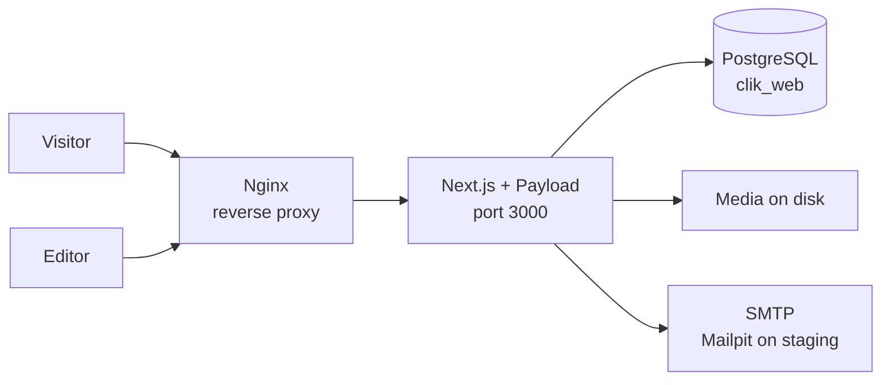

# Architecture

## Shape

One Next.js application serves both the public website and the CMS admin panel.
They share a codebase, a database and a deployment, which keeps operations
simple for a small team.

## Route groups

Next.js route groups keep the two halves apart without affecting URLs:

| Group | Serves |
| --- | --- |
| `src/app/(frontend)/[locale]` | The public website |
| `src/app/(payload)` | The admin panel at `/admin` and the REST and GraphQL APIs |

Each group has its own root layout, so the website's styling never leaks into
the admin panel.

## Languages

Indonesian is the default and carries no prefix; English is served under `/en`.

`src/middleware.ts` rewrites an unprefixed path such as `/tentang-kami` to the
internal `/id/tentang-kami`, so the `[locale]` segment always receives a
language while the visitor's address bar stays clean. Requests to `/admin`,
`/api`, `/_next` and `/media` are passed through untouched.

Page slugs for both languages live in one place, `src/i18n/routes.ts`, so a URL
is never written by hand in a component. Interface strings live in
`src/i18n/dictionaries/`.

Content translation is separate: Payload's own localisation stores an
Indonesian and an English value for every localised field, which is the
`_id` / `_en` model the specification asks for.

## Data

PostgreSQL, chosen because the content is relational — articles belong to
authors, products to categories, coverage to outlets — and because the approval
workflow needs transactions and contact submissions are permanent records.

Payload owns the schema. Changing a collection means regenerating types and
creating a migration; migrations are committed.

Uploaded files are written to disk, not into the database, and are backed up
separately from it.

## Rendering

Pages render on the server. This matters because the site replaces one that
search engines already index, and server rendering is what lets those pages be
crawled with their content intact.

## What is not here yet

Phase 1 delivers the foundation only. Content models, the approval workflow,
the public pages, forms and the English content pass arrive in later phases —
see the [phase plan](./phase-plan.md).
