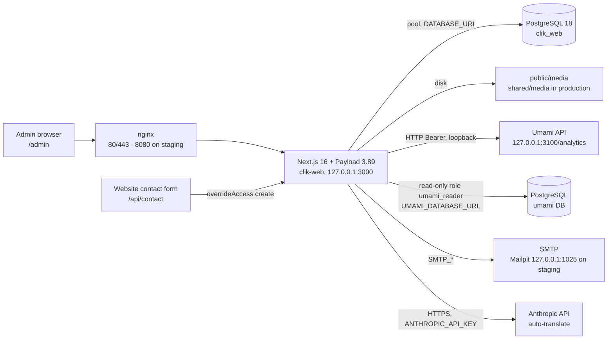

# Technical Specification Document — CLIK CMS

## Document control

| Item | Value |
|---|---|
| Document | Technical Specification Document (TSD) — CLIK CMS |
| Version | 1.0 |
| Date | 2026-09-30 |
| Status | Draft for review |
| Owner | To be confirmed |
| Business requirements | `docs/specs/brd-cms.md` (BR-CMS-01 … BR-CMS-44) |
| Website pair | `docs/specs/brd-website.md`, `docs/specs/tsd-website.md` |
| Code baseline | `/home/dnugroho/clikwebsite`, branch `hardening/security-and-cms-refinement`, read 2026-09-30 |
| Related docs | `docs/architecture.md`, `docs/cms-collections.md`, `docs/approval-workflow.md`, `docs/roles-and-permissions.md`, `docs/analytics.md`, `docs/operations.md`, `docs/contact-form.md`, `scripts/checks/README.md` |

Every statement here was read from the code at the baseline above. `path:line`
references point at that baseline. Configuration is given by **variable name
only**; no values, keys or credentials appear in this document.

---

## 1. Overview and architecture

The CMS is Payload CMS 3 mounted inside the same Next.js application as the
public website (route group `src/app/(payload)`, admin at `/admin`, REST under
`/api`, plus GraphQL). One process, one PostgreSQL database (`clik_web`), one
deployment (`docs/architecture.md`).



The website reads the same collections through `src/lib/content.ts`, using the
shared public rule `publicWhere` (§6.5). See `docs/specs/tsd-website.md`.

## 2. Stack and versions

From `package.json` (installed versions confirmed in `node_modules`):

| Component | Version |
|---|---|
| `payload`, `@payloadcms/next`, `@payloadcms/ui`, `@payloadcms/db-postgres`, `@payloadcms/richtext-lexical` | 3.89.0 (pinned) |
| `@payloadcms/email-nodemailer`, `@payloadcms/live-preview-react` | ^3.89.0 |
| `next` / `eslint-config-next` | 16.3.3 |
| `react`, `react-dom` | 19.2.6 |
| `sharp` | 0.35.4 |
| `@anthropic-ai/sdk` | ^0.126.0 |
| `graphql` | ^16.8.1 |
| `typescript` | 5.7.3 |
| `tsx` (dev, used by `scripts/checks`) | 4.22.4 |
| `pg` | 8.20.0 — **not declared**; resolved through `@payloadcms/db-postgres` (§15) |
| PostgreSQL server | 18.6 (`psql --version` on the server) |
| Node engines | `^18.20.2 \|\| >=20.9.0` |

npm scripts relevant to the CMS: `migrate`, `migrate:create`,
`generate:types`, `generate:importmap`, `payload`, `build`, `start`.

## 3. Code layout (CMS)

| Path | Contents |
|---|---|
| `src/payload.config.ts` | Collections, localization, admin components, DB adapter, email adapter, upload limit, endpoints |
| `src/collections/factory.ts` | `contentCollection()` — builds the four publishing collections with access, versions, hooks and approval fields |
| `src/collections/{Newsroom,Reports,Marketing,Careers}.ts` | `articles`, `reports`, `product-items`, `job-openings` |
| `src/collections/{ContactSubmissions,AuditLog,Users,Media}.ts` | The other four collections |
| `src/access/roles.ts`, `src/access/index.ts` | Roles and access helpers |
| `src/fields/approval.ts` | Approval fields, `lockedForApprover`, `publishedAtField`, language-status UI field |
| `src/fields/common.ts` | Slug, sort order, author, publish date, image rules, `MAX_UPLOAD_MB` |
| `src/fields/editor.ts` | The Lexical editor configuration |
| `src/fields/autoTranslate.ts` | Sidebar UI field for the Auto-translate button |
| `src/hooks/approval.ts` | `enforceApprovalRules`, `syncPublishState`, `assertBothLanguages` |
| `src/hooks/audit.ts` | `recordAudit`, `recordDeletion` |
| `src/endpoints/autoTranslate.ts`, `src/endpoints/verificationLink.ts` | Custom REST endpoints |
| `src/lib/schedule.ts`, `preview.ts`, `translate.ts`, `rateLimit.ts` | Embargo rule, preview URLs, translation client, contact-form limits |
| `src/components/admin/*` | Nav, Dashboard (+ `umami.ts`), ReviewActions, NoSaveDraft, BackToListOnSave, MarkCollection, ApprovalStatusBadge, LanguageStatus, AutoTranslateButton, VerificationLink, DeleteUser(Cell), AuditActorCell, Logo, Icon |
| `src/app/(payload)/custom.scss` | Admin theming and role/collection-specific hiding |
| `src/app/(frontend)/preview/route.ts` | Session-checked draft-mode switch |
| `src/i18n/admin.ts` | Admin UI languages (`id` fallback, `id` + `en` supported) |
| `src/migrations/` | 25 migration files + `index.ts`; `seeds/` |
| `scripts/checks/run.mjs` | End-to-end check suite (§14) |
| `deploy/` | `release.sh`, `rollback.sh`, `backup.sh`, `restore.sh`, `clik-web.service`, `nginx-production.conf` |

## 4. Data model

**Global settings** (`src/payload.config.ts`): localization locales `id`
(default) and `en`, `fallback: true` (`:60-67`). Only `media.alt` and the
Lexical upload caption are Payload-localized; the four publishing collections
store both languages as **paired plain fields** (`…Id` / `…En`).
`lockDocuments: false` is applied to every collection (`:97`, see §11.4).

### 4.1 Shared by the four publishing collections (`factory.ts`)

| Aspect | Value |
|---|---|
| Versions | `drafts: true`, `maxPerDoc: 25` (`factory.ts:129-132`); no autosave |
| Access | read: anonymous → `publicWhere(slug)`; Super Admin / Approver → all; else `moduleReader(owners)`. readVersions: `moduleReader`. create/delete: `moduleEditor`. update: `moduleEditorOrApprover` (`:106-128`) |
| Hooks (approval on) | beforeValidate `enforceApprovalRules`; beforeChange `syncPublishState`; afterChange `recordAudit`; afterDelete `recordDeletion` (`:133-139`) |
| Appended fields | `isSample` (hidden checkbox), `autoTranslate` UI (unless disabled), `languageStatus` UI (unless disabled), `approvalStatusDisplay` UI, `approvalStatus`, `rejectionReason`, `submittedBy`, `submittedAt`, `reviewedBy`, `reviewedAt`, `publishedAt` (`:153-162`) |
| Admin | `hideAPIURL`; PublishButton → `ReviewActions`; SaveDraftButton → `NoSaveDraft`; `BackToListOnSave` + `MarkCollection` before controls; preview / livePreview when a public path is given |
| Timestamps | on |

Approval fields (`src/fields/approval.ts`):

| Field | Type | Required | Access / admin |
|---|---|---|---|
| `approvalStatus` | select `in_review` \| `approved` \| `rejected`, default `in_review` | yes | hidden in form; indexed |
| `rejectionReason` | textarea | no | update: Super Admin or Approver (`decisionFieldAccess`); shown when rejected |
| `submittedBy`, `reviewedBy` | relationship → users | no | update: `() => false` (set only by hooks) |
| `submittedAt`, `reviewedAt` | date | no | update: `() => false` |
| `publishedAt` | date | no | read-only; set by `syncPublishState` |

Every content field carries `access: lockedForApprover` (`approval.ts:125`),
i.e. `update` denied to the Approver.

### 4.2 `articles` (Newsroom.ts) — owners `news_admin`

| Field | Type | Req. | Notes |
|---|---|---|---|
| `cover` | upload → media | no | `imageRule(articleCover)`: min width 832, ratio 1.2–3 |
| `banner` | upload → media | no | `imageRule(articleBanner)`: min 1300, ratio 2.8–4.2 |
| `titleId`, `titleEn` | text | yes | useAsTitle `titleId` |
| `excerptId`, `excerptEn` | textarea | no | |
| `bodyId`, `bodyEn` | richText | no | |
| `relatedArticles` | relationship → articles, hasMany, maxRows 3 | no | excludes self |
| `seoTitleId/En`, `seoDescriptionId/En` | text / textarea | no | |
| `author` | text | no | default = current user's name |
| `slug` | text | yes | from `titleId`; not localized; **unique**; hidden |
| `publishDate` | date | yes | default now; picker `dayAndTime` |
| `isFeatured`, `featuredPositions`, `hideFromList` | checkbox / number[] / checkbox | no | hidden, unread (kept for rollback) |

Preview `/newsroom` · `/en/newsroom`. Scheduled by date.

### 4.3 `reports` (Reports.ts) — owners `news_admin`

| Field | Type | Req. | Notes |
|---|---|---|---|
| `cover` | upload | no | `reportCoverBusiness` (min 832) when type = business_development, else `reportCoverAnnual` (min 1300) |
| `titleId`, `titleEn` | text | yes | |
| `excerptId`, `excerptEn` | textarea | no | |
| `bodyId`, `bodyEn` | richText | **yes** | |
| `financialTables` | array (localized sub-fields) | no | hidden, superseded (migration `20260921_095500`) |
| `type` | select `annual_report` \| `business_development` | yes | default annual |
| `slug` | text | yes | unique, from `titleId` |
| `author` | text | no | |
| `publishDate` | date | no | `dayOnly` |
| `sortOrder` | number, default 0 | no | |

Preview `/laporan` · `/en/reports`. Scheduled by date.

### 4.4 `product-items` (Marketing.ts) — owners `marketing_admin`

| Field | Type | Req. | Notes |
|---|---|---|---|
| `nameId`, `nameEn` | text | yes | useAsTitle `nameId` |
| `shortDescriptionId/En` | textarea | no | |
| `statuses` | select hasMany `live` \| `ready_to_sell` \| `new`, default `['live']` | no | validate ≤ 2 ("Maksimal pilih 2"); not named `status` to avoid Payload's `enum_<table>_status` |
| `descriptionId/En` | richText | no | |
| `featuresId/En`, `suitableForId/En`, `useCasesId/En` | array of `{label: text, required}` | no | |
| `category` | select: credit-scoring, analytics, decisioning, business-intelligence, consulting | yes | |
| `sortOrder` | number | no | |

No slug. `autoTranslate: false`, `languageStatus: false`. Preview opens
`/layanan-dan-produk/credit-scoring` (`previewPath`). Not scheduled by date.

### 4.5 `job-openings` (Careers.ts) — owners `hr_admin`

| Field | Type | Req. | Notes |
|---|---|---|---|
| `titleId`, `titleEn` | text | yes | |
| `slug` | text | yes | unique, from `titleId` |
| `category` | select from `jobCategories` (`src/content/careers.ts`) | yes | it, analytics, sales-business-development, operations, finance |
| `responsibilitiesId/En`, `minimumQualificationsId/En` | richText | no | |
| `applyUrl` | text | no | empty → careers page default |
| `isOpen` | checkbox, default true | no | |
| `sortOrder` | number | no | |

`autoTranslate: false`, `languageStatus: false`. Preview `/karir` · `/en/careers`.
Not scheduled by date.

### 4.6 `contact-submissions` (ContactSubmissions.ts)

Access: create `() => false`; read/update Super Admin or Sales Admin; delete
`() => false` (`:23-36`). No versions.

| Field | Type | Req. | Update access |
|---|---|---|---|
| `firstName`, `lastName`, `companyName` | text | yes | denied |
| `email` | email, indexed | yes | denied |
| `phone` | text, indexed | yes | denied |
| `interestedIn` | select (7 options) | yes | denied |
| `hearAboutUs` | select (8 options) | no | denied |
| `message` | textarea | no | denied |
| `consent` | checkbox | yes | denied |
| `marketingChannels` | select hasMany (4) | no | denied |
| `marketingPreference` | select `opt_in` \| `opt_out` | no | denied |
| `locale`, `pageUrl`, `ipAddress` (indexed), `userAgent`, `consentTextVersion` | text / textarea | no | denied |
| `followUpStatus` | select `new` (Baru) \| `follow_up` (Ditindaklanjuti), default `new` | yes | allowed |
| `followedUpBy` / `followedUpAt` | relationship → users / date | no | denied (hook-set) |

Hooks: beforeChange stamps or clears `followedUpBy/At` when `followUpStatus`
changes (`:163-184`); afterChange `recordAudit`.

### 4.7 `audit-log` (AuditLog.ts)

Access: read `superAdminOnly`; create/update/delete `() => false`. Fields:
`action` (text, req., indexed), `collectionSlug` (indexed), `documentId`
(indexed), `documentTitle`, `user` (relationship → users), `userEmail`,
`detail` (textarea), `actor` (UI cell `AuditActorCell`). Written only by hooks
with `overrideAccess: true`.

### 4.8 `users` (Users.ts)

Auth collection. Fields: `name` (text, req.), `role` (select of 6, req.,
default `news_admin`, update: Super Admin only), UI fields `verificationLink`,
`deleteAccount`, `deleteRow`. Access: read/update Super Admin → all, others →
`{ id: { equals: user.id } }`; create/delete Super Admin (`:108-120`). Hooks:
beforeChange last-Super-Admin demotion guard; beforeDelete self-delete and
last-Super-Admin guard; afterChange `recordAudit`; afterDelete
`recordDeletion`. Auth options in §9.

### 4.9 `media` (Media.ts)

Upload collection. Fields: `alt` (text, req., **localized**), `isSample`
(hidden). Access: read `() => true`; create/update: signed in and not
Approver and not Sales Admin; delete: Super Admin (`:30-35`). Hooks:
beforeValidate replace guard and size message; afterChange/afterDelete audit.
Upload settings in §10. Not versioned.

## 5. Access control design

**Roles** (`src/access/roles.ts:8-15`): `super_admin`, `hr_admin`,
`news_admin`, `marketing_admin`, `sales_admin`, `approver`. Helpers:
`hasRole`, `isSuperAdmin`, `isApprover`, `isSalesAdmin`, `isEditor`.

**Module ownership** (`src/access/index.ts:56-61`): `karir → hr_admin`,
`newsroom → news_admin`, `laporan → news_admin`, `marketing → marketing_admin`.

| Helper | Grants | Used for |
|---|---|---|
| `moduleEditor(...owners)` | Super Admin + owners | create, delete |
| `moduleEditorOrApprover(...owners)` | + Approver | update (the Approver must save a decision) |
| `moduleReader(...owners)` | Super Admin + Approver + owners | read (signed in), readVersions |
| `contentFieldAccess` → `lockedForApprover` | everyone except Approver | `update` on every content field |
| `decisionFieldAccess` | Super Admin, Approver | `rejectionReason` update |
| `superAdminOnly` | Super Admin | audit-log read |

**readVersions** is set explicitly because Payload otherwise lets any signed-in
user read every version (`factory.ts:119-124`).

**Order of enforcement.** Payload runs field-level access in the fields'
beforeValidate pass, deleting denied values from the incoming data, *before*
the collection's `beforeValidate` hooks (`node_modules/payload/dist/fields/hooks/beforeValidate/promise.js:216-227`;
`collections/operations/utilities/update.js:88-105`). So a client cannot set
`submittedBy`, `reviewedBy`, timestamps or (as Approver) any content field,
while the hooks can still set those values server-side.

**Admin mirroring (display only).** `Nav.tsx` filters menu items by role
(OWNERS map; Approver allow-list of the four publishing collections; Media
absent for all) and stamps `data-role` on `<body>`. `custom.scss` hides the
Columns chooser for everyone (`:394`), the doc tabs for the Approver (`:264`),
"Revert to published" for non-Super-Admins (`:405`), and the locale switcher on
the four paired collections (`:274-278`). These are cosmetic; the server rules
above are authoritative.

## 6. Workflow state machine

### 6.1 States

Two coupled state variables: `approvalStatus` (business state) and Payload's
`_status` (`draft` / `published`) on each **version**. The main document row —
what the website reads — changes only on a non-draft (publish) save.

```mermaid
stateDiagram-v2
  [*] --> InReview: editor or SA "Kirim untuk ditinjau"\n(draft save)
  [*] --> Approved: SA "Setujui & tayangkan"\n(publish, both languages)
  InReview --> InReview: submitter edits (draft)\nothers → 423 locked
  InReview --> Approved: Approver/SA approve\n(publish; assertBothLanguages)
  InReview --> Rejected: Approver/SA reject\n(draft; reason required)
  Approved --> InReview: any edit (draft)\nlive version unchanged
  Rejected --> InReview: any edit (draft)
  Approved --> Approved: SA "Setujui & tayangkan" on approved item
```



| Button (ReviewActions.tsx) | Role | Request | Resulting approvalStatus / `_status` |
|---|---|---|---|
| Kirim untuk ditinjau | editors, Super Admin | PATCH/POST `?draft=true`, `_status: draft`, `skipValidation` (`:56-64`) | `in_review` / draft version |
| Setujui & tayangkan | Super Admin; Approver on `in_review` | form submit with `approvalStatus: approved`, `_status: published` (`:66-67`) | `approved` / published |
| Tolak → Kirim penolakan | Approver on `in_review` | draft save with `approvalStatus: rejected`, `rejectionReason` | `rejected` / draft version |

`NoSaveDraft` replaces Payload's Save-draft button with nothing.

### 6.2 `enforceApprovalRules` (beforeValidate, `src/hooks/approval.ts:145-326`)

Skipped when there is no `req.user` (seed scripts / local API). A status counts
as a choice only if it differs from the stored one (`deliberate`, `:139`).

- **Super Admin:** editing an `approved`/`rejected` item without a deliberate
  status change and without "approving now" (`approved` + `_status:
  published`) resets to `in_review`, stamps `submittedBy/At`, clears the
  reason. Otherwise the chosen status stands, with: rejection needs a reason
  (400); approval runs `assertBothLanguages`.
- **Approver:** status must be `approved` or `rejected` (else 403); previous
  status must be `in_review` (else 400); rejection needs a reason (400);
  approval runs `assertBothLanguages`; stamps `reviewedBy/At`.
- **Editors:** target is always `in_review`; a deliberate other value → 403.
  If previous is `in_review` and the user is not `submittedBy` → **423**
  "locked while it is in review" (`:250-258`). The Indonesian title
  (`titleId`, or `nameId` for products) must be non-empty (400). On entering
  review, stamps `submittedBy/At` and clears the reason.

### 6.3 `syncPublishState` (beforeChange, `:329-338`)

`approved` → `_status = 'published'` and `publishedAt` set if empty; any other
status → `_status = 'draft'`.

### 6.4 `assertBothLanguages` (`:40-127`)

Reads the stored document with `locale: 'all'`, `draft: true`,
`overrideAccess: true`, `req`, and overlays the incoming data, so it judges the
post-save state (also on create). Title base is `title` or `name` (paired
`…Id/…En`); long-text base is `description`, else `responsibilities`, else
`body`. Title required in both; long text required in both only if present in
one (Lexical emptiness via `richTextFilled`). Failure → 400 "Belum bisa
disetujui — …".

Note: Payload skips required-field validation on draft saves and
ReviewActions sends `skipValidation: true`, so `required` constraints
(e.g. `bodyId/En` on reports) are enforced at approval (publish) time, not at
submission.

### 6.5 Scheduling (`src/lib/schedule.ts`)

`publicWhere(collection)` = `_status = published`, and for `articles` and
`reports` (`SCHEDULED_BY_DATE`) additionally `publishDate < start of tomorrow
in Asia/Jakarta` or `publishDate` absent (`:44-58`). Used by the collections'
anonymous read rule and by the website queries, so REST, GraphQL and pages
agree. The file has no imports to avoid a config import cycle.

## 7. Audit logging design (`src/hooks/audit.ts`)

| Element | Behaviour |
|---|---|
| `recordAudit` (afterChange, `:83-153`) | action = `create`/`update`, renamed `submit`/`approve`/`reject` when `approvalStatus` changed. Skips an `update` with no loggable change. Writes `action`, `collectionSlug`, `documentId`, `documentTitle`, `user`, `userEmail`, `detail`. |
| `recordDeletion` (afterDelete, `:155-182`) | action `delete`, same identity fields. |
| `titleOf` (`:4-19`) | first of `title`, `titleId`, `name`, `nameId`, `email`, `filename`, `id`; localized objects → first non-empty value. |
| `NEVER_LOG` (`:26-38`) | `password`, `hash`, `salt`, `_verificationToken`, `resetPasswordToken`, `resetPasswordExpiration`, `loginAttempts`, `lockUntil`, `updatedAt`, `createdAt`, `sizes` |
| `describeChange` (`:56-76`) | names changed keys (JSON comparison), spells out `…status` moves as `key: old -> new`, never prints other values. |
| `detail` | rejection → the reason; anonymous create on `contact-submissions` → "Dikirim dari formulir publik"; else the change summary. |
| Transaction | Both hooks pass `req` to `payload.create`, so the entry is written in the save's transaction on the same pooled connection (`:143`, `:175`). A failed insert is logged and **rethrown**, rolling back the change. |

Attached to: all four publishing collections, `contact-submissions`
(afterChange only; nothing can be deleted), `users`, `media`. Not attached to
`audit-log` itself or Payload's internal tables. Existing entries were
back-filled with titles by migration `20260925_150000_audit_titles`. User
references use SET NULL on delete (`Users.ts` comment `:206-209`) and
`AuditActorCell` falls back to `userEmail`, or "Sistem" when neither exists.

## 8. Custom endpoints and admin components

### 8.1 `POST /api/auto-translate` (`src/endpoints/autoTranslate.ts`)

| Aspect | Specification |
|---|---|
| Body | `{ "collection": "articles" \| "reports", "id": "<doc id>" }` (`global` refused) |
| Auth | signed-in session; role must be Super Admin or an owner of the collection (`TRANSLATABLE`, `:12-15`) |
| Rate limit | 30 calls per user per rolling hour, in-memory `Map` (`:22-35`) |
| Processing | reads the doc with `overrideAccess: false` as the user; for each of `title`, `excerpt`, `body`, `seoTitle`, `seoDescription` whose `…En` is blank, collects strings from `…Id` (skipping `SKIP_KEYS`), translates, writes to `…En` via `payload.update(..., draft: true, overrideAccess: false, user)` — so the normal approval hooks run |
| Responses | 200 `{translated, fields, message}` or `{translated: 0, message}`; 400 invalid body / missing id / not translatable; 401 not signed in; 403 not an owner; 429 over limit; 503 `TranslationNotConfigured`; 500 other errors |

Translation client (`src/lib/translate.ts`): Anthropic SDK, model
`claude-opus-5`, `max_tokens` 16000, system prompt with a 12-entry glossary and
a do-not-translate list; input and output are a JSON object of field paths →
strings; a refusal stop reason or non-JSON reply raises an error. Requires
`ANTHROPIC_API_KEY`.

### 8.2 `GET /api/verification-link/:id` (`src/endpoints/verificationLink.ts`)

Super Admin only (403 otherwise). Returns `{verified: true}`, or
`{verified: false, email, link}` built as `<origin>/admin/verify/<token>`, or
`reason: 'no_token'`. The origin is taken from `x-forwarded-host`/`host`
headers, falling back to `SITE_URL` (see §15).

### 8.3 Preview route (`src/app/(frontend)/preview/route.ts`)

`GET /preview?path=…&collection=…`. Collection must be in
`articles, reports, job-openings, product-items`; path must start with `/` and
not with `//` or contain `\` (400). Authenticates the session with
`payload.auth`; 403 if none. Checks access by `payload.find({collection, user,
overrideAccess: false, draft: true, limit: 1})`; 403 if it throws. Then enables
Next draft mode and redirects. No secret in the URL. URLs are built relative by
`previewFor` / `livePreviewFor` (`src/lib/preview.ts`); Live Preview
breakpoints 1440/768/390.

### 8.4 Dashboard (`Dashboard.tsx` + `umami.ts`)

Replaces Payload's dashboard view (`payload.config.ts:45-51`); a server
component, shown to every role. Fixed range 7 days.

```mermaid
sequenceDiagram
  participant D as Dashboard (server)
  participant API as Umami API (UMAMI_BASE_URL)
  participant DB as umami DB (umami_reader)
  D->>API: GET /api/websites/{id}/stats · performance/stats · breakdown(path) · breakdown(referrer) · performance/metrics?type=path&metric=lcp
  Note over D,API: Authorization: Bearer UMAMI_API_KEY, no-store, 6 s timeout
  D->>DB: PAGE_SQL on website_event ($1 site, $2..$3 range)
  D-->>D: merge rows; LCP p75 per path; rate() vs thresholds
```

- `get()` never throws; any failure → `null` → `EMPTY` shape with `ok:false`
  (`umami.ts:67-81`). Not configured (`UMAMI_API_KEY` or website id missing) →
  notice naming the variables.
- `PAGE_SQL` (`:130-150`): window functions over `website_event`
  (`event_type = 1`) per `visit_id`; time on page = `avg(least(next_at -
  created_at, 1800 s))` excluding the last page of a visit; entrances = first
  page; bounces = first page of a one-page visit; top 10 by views. Pool of
  max 2 connections (`:126`). On failure, falls back to API `breakdown`
  views/visitors with time and bounce shown empty.
- Vitals thresholds (p75): LCP 2500/4000 ms, INP 200/500, CLS 0.1/0.25,
  FCP 1800/3000, TTFB 800/1800 (`:88-94`) → Baik / Perlu perbaikan / Buruk.
- Tiles: visitors and page views with change vs previous period; bounce rate =
  bounces / visits; average visit = totaltime / visits.

### 8.5 Other admin components

| Component | Role |
|---|---|
| `ReviewActions` | Decision/submit buttons (§6.1) |
| `BackToListOnSave` | Navigates to the list only when `lastUpdateTime` changed (a real success) |
| `MarkCollection` | Sets `data-collection` on `<body>` for CSS |
| `ApprovalStatusBadge`, `LanguageStatus` | Read-only status label; per-language completeness panel (articles, reports) |
| `AutoTranslateButton` | Calls `/api/auto-translate` |
| `VerificationLink` | Shows the activation link to a Super Admin |
| `DeleteUser`, `DeleteUserCell` | Two-step delete on the user page / list row; render nothing for non-Super-Admins |
| `AuditActorCell` | Name, else stored email, else "Sistem" |
| `Nav`, `Logo`, `Icon` | Custom sidebar and CLIK branding |

## 9. Authentication and email

| Item | Implementation |
|---|---|
| Session cookie | `secure` iff `SITE_URL` starts with `https://`; `sameSite: 'Lax'` (`Users.ts:92-95`); read at server start |
| Lock-out | Payload defaults (not overridden): `maxLoginAttempts` 5, `lockTime` 600000 ms; `tokenExpiration` 7200 s (`node_modules/payload/dist/collections/config/defaults.js:118-129`) |
| Verification | `auth.verify` on; bilingual HTML email, link `<siteOrigin>/admin/verify/<token>` |
| Forgot password | Bilingual HTML email, link `<siteOrigin>/admin/reset/<token>`; token expiry Payload default 1 hour (`forgotPassword.js:78`) |
| `siteOrigin()` | `SITE_URL` or `NEXT_PUBLIC_SERVER_URL`, trailing slash removed — never the request Host (`Users.ts:15-16`) |
| Email adapter | `@payloadcms/email-nodemailer`; `SMTP_HOST` (default 127.0.0.1), `SMTP_PORT` (default 1025), `SMTP_SECURE`, `SMTP_USER`/`SMTP_PASS` (auth only if user set), `EMAIL_FROM_ADDRESS`, `EMAIL_FROM_NAME` (`payload.config.ts:136-147`) |
| Last Super Admin | beforeChange refuses demoting the only Super Admin; beforeDelete refuses self-delete and deleting the last Super Admin (400) |
| Existing accounts | Migration `20260923_154839_users_email_verification` set `_verified = true` where null |

## 10. Media and uploads

| Item | Implementation |
|---|---|
| Storage | `staticDir` `public/media` (`Media.ts:95`); production nginx serves `/media/` from `/srv/clik/shared/media/` |
| MIME allow-list | `image/jpeg`, `image/png`, `image/webp`, `image/gif`, `image/avif`, `application/pdf` (`Media.ts:102`) — no SVG |
| Image sizes | `thumbnail` 400×300, `card` 768×512, `wide` 1440 (sharp) |
| Size limit | `MAX_UPLOAD_MB = 5` (`fields/common.ts:14`); parser limit `upload.limits.fileSize` with `abortOnLimit` (`payload.config.ts:110-114`); readable 413 in `Media` beforeValidate; nginx `client_max_body_size 25M`; Next Server Action `bodySizeLimit` 25mb |
| Replace guard | beforeValidate: `operation === 'update' && req.file && !isSuperAdmin` → 403 (`Media.ts:46-53`) |
| Field rules | `imageRule` (`common.ts:330-382`) checks only a newly chosen file: size ≤ 5 MB, ratio within bounds, width ≥ `minWidth` (`IMAGE_RULES`, `:253-307`) |
| Sandbox headers | `next.config.ts` `headers()`: `/api/media/file/:path*` and `/media/:path*` get `Content-Security-Policy: default-src 'none'; img-src 'self' data:; style-src 'unsafe-inline'; sandbox` and `X-Content-Type-Options: nosniff`; same CSP in `deploy/nginx-production.conf:108` |
| Inline images | Lexical `UploadFeature` on `media` with a localized `caption` field (`fields/editor.ts`) |

## 11. Database and migrations

### 11.1 Adapter

`postgresAdapter({ pool: { connectionString: DATABASE_URI,
connectionTimeoutMillis: 10_000 }, push: false })` (`payload.config.ts:115-130`).
Pool size is not set, so the `pg` default of 10 applies (`docs/operations.md`
states "at most 10"). `push: false`: schema changes only through committed
migrations.

### 11.2 Migrations

25 migration files in `src/migrations/` (registered in `index.ts`), run by
`npm run migrate` (also by `deploy/release.sh:85`). Since 25 September they are
**hand-written** (e.g. `20260925_130000_enquiry_follow_up_status`,
`20260925_150000_audit_titles`, `20260929_120000_unique_slugs`) because the
schema snapshot `migrate:create` compares against is stale (§15). Hand-written
migrations follow "add, copy, count, then drop" so data is not lost.

### 11.3 Unique slugs

`slugField(from, localized=false)` sets `unique: true` and a beforeValidate hook
that slugifies and probes `base`, `base-2` … `base-99` with `payload.count(…,
overrideAccess: true, req)`, excluding the document itself
(`fields/common.ts:24-80`). Migration `20260929_120000_unique_slugs` renamed
the one existing clash (report 8 → `gundul-gundul-pacul-2`, including its
versions), refuses to continue if other duplicates exist, and recreates
`articles_slug_idx`, `reports_slug_idx`, `job_openings_slug_idx` as UNIQUE.

### 11.4 Why `lockDocuments: false`

Payload's lock check reads the locked-documents table outside the save's
transaction (without `req`), needing a second pooled connection while the save
holds one. Twenty concurrent saves exhausted the 10-connection pool and hung
every request, including public pages (`payload.config.ts:69-80`;
`docs/operations.md` "Database connections"). The in-review lock of §6.2
replaces the lost "someone is editing" notice. The `payload_locked_documents`
tables remain in the database, unused.

## 12. Configuration (names only)

| Variable | Used by |
|---|---|
| `DATABASE_URI` | Postgres adapter |
| `PAYLOAD_SECRET` | Session signing |
| `SITE_URL` | Cookie `secure` flag, email links, allowed Server Action origins |
| `NEXT_PUBLIC_SERVER_URL` | Fallback for email links; allowed origins |
| `SITE_ENV` | Search-engine indexing (website) |
| `SMTP_HOST`, `SMTP_PORT`, `SMTP_SECURE`, `SMTP_USER`, `SMTP_PASS` | Email adapter |
| `EMAIL_FROM_ADDRESS`, `EMAIL_FROM_NAME` | Sender |
| `CONTACT_FORM_RECIPIENT` | Enquiry email (website route) |
| `ANTHROPIC_API_KEY` | Auto-translate |
| `UMAMI_BASE_URL`, `UMAMI_API_KEY`, `UMAMI_WEBSITE_ID` | Dashboard API reads |
| `UMAMI_DATABASE_URL` | Dashboard read-only DB reads |
| `NEXT_PUBLIC_UMAMI_WEBSITE_ID`, `NEXT_PUBLIC_UMAMI_SRC` | Website tracking script (website TSD) |

Configuration lives in `.env` (staging) or `/srv/clik/shared/.env`
(production), never committed.

## 13. Operations

| Task | How | Source |
|---|---|---|
| Service | systemd `clik-web` (port 3000, localhost); `umami` (3100); `mailpit` (1025/8025) | `docs/operations.md` |
| Release | `sudo ./deploy/release.sh [ref]`: build in new release folder → `backup.sh` → `npm run migrate` → switch `current` → restart → check `/` and `/admin/login`, auto-revert on failure; keeps 5 releases | `deploy/release.sh` |
| Rollback | `sudo ./deploy/rollback.sh [dir]`; does not undo migrations | `docs/operations.md` |
| Backup | nightly 02:00 via `/etc/cron.d/clik-backup` → `/var/backups/clik` (`clik_web`, `umami` dumps, media tarball), 30 days, root-only | `deploy/backup.sh` |
| Restore | `sudo ./deploy/restore.sh <db.dump> <media.tar.gz>`; umami restored separately with `pg_restore` | `deploy/restore.sh` |
| Page cache | nginx 60 s cache for anonymous public pages; `/admin`, `/api`, `/preview` and signed-in users bypass | `docs/operations.md` |
| Staging | runs from the working checkout, rebuilt in place | `docs/operations.md` |
| Editor-list change | after changing Lexical features run `npx payload generate:importmap` | `docs/cms-collections.md` |

## 14. Testing

There is no unit-test suite (deferred, `docs/deferred-items.md`). The
end-to-end suite `node --env-file=.env --import tsx scripts/checks/run.mjs`
runs **on staging only** (it creates and deletes `ZZCHK` probe data); exit
code = number of failures. CMS-relevant checks (`scripts/checks/run.mjs`):

| Line | Check |
|---|---|
| 84-89 | Publish-date embargo on REST, GraphQL and page |
| 91 | No secret in the admin edit page |
| 96-99 | Preview: needs session; refused to Sales; allowed to module editor; off-site path refused |
| 102-103 | Version history refused to HR and to anonymous |
| 105-107 | Auto-translate refuses non-content collection and non-owner |
| 112-118 | Enquiries not creatable via REST or GraphQL; 3-per-contact under concurrency |
| 127 | Last Super Admin cannot be demoted |
| 138-144 | Approval refused with a language missing; rejection refused without reason |
| 150-162 | SVG refused; uploads served sandboxed; nosniff and frame protection |
| 166 | Reset email link uses `SITE_URL` with a forged Host |
| 180 | 30 simultaneous saves finish and the site stays up |
| 193 | Live page stays live while its edit is reviewed |
| 202 | Slug clash gets `-2` |
| 207 | Only Super Admin replaces an image file |

Admin UI per role (buttons, dashboard) is checked by hand
(`scripts/checks/README.md` "Browser checks").

## 15. Known limitations and technical debt

| # | Item | Evidence | Status |
|---|---|---|---|
| TD-01 | An editor calling REST directly with a **non-draft** save of their own live item: `syncPublishState` sets `_status: draft` on the main document, taking the page offline. | `hooks/approval.ts:329-338`; `docs/approval-workflow.md` | Accepted (editors can delete anyway) |
| TD-02 | Migration schema snapshot is stale; latest `.json` snapshot is `20260923_154839`, the three later ones (25–29 Sep) have none, so `migrate:create` cannot generate. | `src/migrations/`; `docs/operations.md` "Known gaps" | Open — take a fresh snapshot |
| TD-03 | Unused code: `authenticated`, `authenticatedOrPublished` (`access/index.ts:7-13`); `seoFields` (`fields/common.ts:110`); `isSuperAdminUser` (`fields/approval.ts:133`); `enforceApprovalRulesGlobal`, `syncPublishStateGlobal` (`hooks/approval.ts:341-366`, no globals exist); `EDITOR_ROLES`/`isEditor` (only self-referenced); `legacyList`, the `group` constant and the `slugField` import in `Marketing.ts`; the `global` branches of the auto-translate endpoint (unreachable, refused at `:132`). | grep across `src/` | Clean-up candidate |
| TD-04 | `pg` is imported by `components/admin/umami.ts` but not declared in `package.json`; it resolves only because `@payloadcms/db-postgres` depends on `pg` 8.20.0. | `package.json`; `node_modules/@payloadcms/db-postgres/package.json:70` | Open — declare it |
| TD-05 | In-memory limits (auto-translate 30/h; contact-form `oneAtATime` queue) assume a single Node process; reset on restart. | `endpoints/autoTranslate.ts:17-21`; `lib/rateLimit.ts` | Accepted while single-process |
| TD-06 | `verification-link` endpoint builds the link from `x-forwarded-host`/`host`, unlike the email path which uses `SITE_URL` only. Super-Admin-only, but inconsistent with the stated rule. | `endpoints/verificationLink.ts:44-48` | Review |
| TD-07 | Media sits outside approval: any editor role may update any media document's `alt` text, live immediately; only file replacement is guarded. | `collections/Media.ts:30-53` | Open (BRD OI-07) |
| TD-08 | Required fields are not enforced on draft saves (`skipValidation: true`, Payload drafts); enforced at publish. | `ReviewActions.tsx:62` | By design; note for testers |
| TD-09 | Stale comments: `next.config.ts` says the CMS accepts 20MB (limit is 5 MB); `lib/preview.ts` says the slug is localised (it is not); `MarkCollection.tsx` says the locale switcher matters for job openings (hidden there by `custom.scss:277`); `ContactSubmissions.ts` "built in Phase 5"; trailing CTA-block comment at the end of `Marketing.ts`. | files named | Clean-up |
| TD-10 | `payload_locked_documents` tables unused; next `migrate:create` will offer to drop them. | `docs/operations.md` | Open |
| TD-11 | Pool size relies on the `pg` default (10); not explicit in config. | `payload.config.ts:115-125` | Consider making explicit |
| TD-12 | Docs drift: `docs/architecture.md` describes `src/middleware.ts` (the code has `src/proxy.ts`) and Payload localisation for content (content uses paired fields); `docs/deferred-items.md` lists scheduling/preview and analytics as not built; articles' publish date documented as date-only but configured `dayAndTime`. | files named | Update docs |

## 16. Traceability

| BR-CMS | Topic | TSD section(s) |
|---|---|---|
| 01 | Role-based access | 5, 4.1 |
| 02 | Users managed by Super Admin | 4.8, 5 |
| 03 | Account activation | 9, 8.2 |
| 04 | Password reset | 9 |
| 05 | Lock-out | 9 |
| 06 | Last Super Admin | 4.8, 9 |
| 07 | Deleting users | 4.8, 7, 8.5 |
| 08 | Role-filtered menu, no Media menu, no Columns | 5 (admin mirroring) |
| 09 | Admin UI languages | 3 (`src/i18n/admin.ts`) |
| 10 | Berita | 4.2 |
| 11 | Laporan | 4.3 |
| 12 | Produk | 4.4 |
| 13 | Karir | 4.5 |
| 14 | Rich text editor | 3 (`fields/editor.ts`), 10 |
| 15 | Unique slugs | 11.3 |
| 16 | Preview / Live Preview | 8.3 |
| 17 | Revision history | 4.1 |
| 18 | Paired languages | 4 (global settings), 5 |
| 19 | Indonesian title to save | 6.2 |
| 20 | Both languages to approve | 6.4 |
| 21 | Auto-translate | 8.1 |
| 22 | Statuses; save = submit | 6.1, 6.2 |
| 23 | Approver decisions | 6.1, 6.2, 5 |
| 24 | Super Admin approve & publish | 6.1, 6.2 |
| 25 | No self-approval | 6.2 |
| 26 | Live stays online | 6.1, 6.3, 15 (TD-01) |
| 27 | In-review lock | 6.2, 11.4 |
| 28 | Direct delete | 4.1, 7 |
| 29 | Back to list on success | 8.5 |
| 30 | Publish-date embargo | 6.5 |
| 31 | Enquiries only from form | 4.6, 1 |
| 32 | Enquiries permanent | 4.6 |
| 33 | Follow-up status | 4.6 |
| 34 | Images in fields | 4.9, 5 |
| 35 | Replace file = Super Admin | 10 |
| 36 | File types and sizes | 10 |
| 37 | Sandboxed uploads | 10 |
| 38 | Audit of every change | 7 |
| 39 | Audit log protection | 4.7, 7 |
| 40 | Analytics dashboard | 8.4 |
| 41 | Dashboard degrades | 8.4 |
| 42 | System emails | 9 |
| 43 | Enquiry email | 1, 12 (see `docs/specs/tsd-website.md`) |
| 44 | Workflow notifications (not built) | — (BRD OI-03) |
