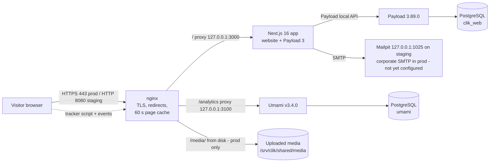

# Technical Specification Document — CLIK Public Website

| | |
|---|---|
| Document | TSD — CLIK public website |
| Version | 1.0 |
| Date | 2026-09-30 |
| Status | Draft for review |
| Owner | To be confirmed |
| Codebase | `/home/dnugroho/clikwebsite` (branch at time of writing: `hardening/security-and-cms-refinement`) |
| Related documents | `docs/specs/brd-website.md` (requirements, BR-WEB-xx) · `docs/specs/brd-cms.md`, `docs/specs/tsd-cms.md` (CMS) · `docs/architecture.md` · `docs/operations.md` · `docs/deployment.md` · `docs/cutover-runbook.md` · `docs/contact-form.md` · `docs/analytics.md` · `scripts/checks/README.md` |

Scope: the public website — routing, pages, data reads, the contact form endpoint, analytics, security, caching, SEO, environments and release. The CMS (collections, roles, approval workflow, admin UI) is covered in `docs/specs/tsd-cms.md` and appears here only where the website reads from or writes to it. Every statement below was checked against the code or the docs named; unknowns are listed as open items in §15.

---

## 1. Overview and architecture

One Next.js application serves the public website and the Payload CMS admin (`/admin`) from one codebase, one database and one deployment (`docs/architecture.md`, decision 12). The website reads CMS content in-process through Payload's **local API** — there is no HTTP hop between website and CMS.



Key flows:

- **Page view:** browser → nginx (cache HIT returns immediately) → `src/proxy.ts` (language rewrite) → `src/app/(frontend)/[locale]/[[...slug]]/page.tsx` → page component → `src/lib/content.ts` (Payload local API) and/or `src/content/*.ts` (static bilingual copy).
- **Contact form:** browser `POST /api/contact` → nginx (never cached; sets `X-Real-IP`) → `src/app/api/contact/route.ts` → rate-limit + insert into `contact-submissions` → email via Payload's nodemailer adapter.
- **Analytics:** `src/components/layout/Analytics.tsx` loads `/analytics/script.js`; events go back to Umami via nginx.

## 2. Technology stack

Versions from `package.json` (installed versions confirmed in `node_modules`).

| Layer | Technology | Version |
|---|---|---|
| Framework | Next.js (App Router) | 16.3.3 |
| UI | React / React DOM | 19.2.6 |
| CMS | Payload (`payload`, `@payloadcms/next`, `@payloadcms/ui`, `@payloadcms/db-postgres`, `@payloadcms/richtext-lexical`) | 3.89.0 |
| CMS add-ons | `@payloadcms/email-nodemailer`, `@payloadcms/live-preview-react` | ^3.89.0 |
| Images | sharp | 0.35.4 |
| Language | TypeScript | 5.7.3 |
| Database | PostgreSQL | 18 (`intent/00` O1; server has 18.6) |
| DB driver | `pg` | 8.20.0 — **transitive only**, see §15 |
| Web server | nginx | 1.28.3 on the staging server |
| Analytics | Umami (self-hosted) | tag `v3.4.0` (`docs/analytics.md`) |
| Runtime | Node.js | engines `^18.20.2 \|\| >=20.9.0`; server runs v22.22.1 |
| Other | `@anthropic-ai/sdk` ^0.126.0 (CMS auto-translate only), `dotenv` 16.4.7, `graphql` ^16.8.1, `server-only` | |
| Dev | ESLint ^9.16 + `eslint-config-next` 16.3.3, Prettier ^3.4.2, `tsx` 4.22.4 | |

Styling is CSS Modules plus design tokens in `src/styles/tokens.css`; no utility framework (`docs/design-system.md`). Nunito Sans is self-hosted through `next/font` (`src/app/(frontend)/[locale]/layout.tsx:19`).

## 3. Repository layout (website-relevant)

| Path | Holds |
|---|---|
| `src/proxy.ts` | Language rewrite (Next 16 "proxy", formerly middleware) |
| `src/app/(frontend)/[locale]/layout.tsx` | Public root layout: font, metadata defaults, header/footer, analytics, draft-mode refresh |
| `src/app/(frontend)/[locale]/[[...slug]]/page.tsx` | Single catch-all route that dispatches every public page |
| `src/app/(frontend)/[locale]/not-found.tsx` | 404 page |
| `src/app/(frontend)/sitemap.ts`, `src/app/robots.ts` | `sitemap.xml`, `robots.txt` (both `force-dynamic`) |
| `src/app/(frontend)/preview/route.ts` | Enables draft mode for signed-in editors |
| `src/app/api/contact/route.ts` | Contact form endpoint |
| `src/app/(payload)/…` | Payload admin, REST (`/api/[...slug]`) and GraphQL — see CMS TSD |
| `src/i18n/` | `config.ts` (locales), `routes.ts` (address map), `dictionaries/{id,en}.json` (UI strings), `index.ts` (`getDictionary`) |
| `src/components/pages/` | One component per page type (13 files + icon helpers) |
| `src/components/layout/` | Header, Footer, Breadcrumb, Container, LanguageSwitch, PageHeader, Analytics |
| `src/components/sections/` | ContactForm, carousels, HeroSlider, ProductAccordion, NewsroomSidebar, CTASection, JobRow, Cards, Marquee |
| `src/components/ui/` | Button, BackToTop, Pagination, RichText (+ converters), StatusBadge, RefreshOnSave, Prose |
| `src/content/` | Static bilingual page copy (`home`, `about`, `products`, `careers`, `contact`, `cta`, `newsroom`, `partners`, `policies`, `site`, `testimonials`) |
| `src/lib/` | `content.ts` (CMS reads), `schedule.ts` (publish-date rule), `preview.ts`, `rateLimit.ts`, `contactForm.ts`, `format.ts`, `translate.ts` (CMS) |
| `src/styles/` | `tokens.css`, `globals.css` |
| `public/images/` | Page imagery, logos, icons; `public/media/` holds CMS uploads (not in git) |
| `next.config.ts` | Server Actions origins, image patterns, upload headers |
| `deploy/` | `nginx-production.conf`, `redirects.map`, `release.sh`, `rollback.sh`, `backup.sh`, `restore.sh`, `clik-web.service` |
| `scripts/` | `checks/run.mjs` (verification suite), `build-redirects.py` + `legacy-sitemap.xml`, seed scripts, `migrate-report-tables.mjs` (stale, §15) |

## 4. Routing and internationalisation

### 4.1 Locales and URL scheme

- `src/i18n/config.ts`: `locales = ['id','en']`, `defaultLocale = 'id'`.
- Indonesian has no prefix; English is under `/en`.
- `src/proxy.ts:21` rewrites any unprefixed path to `/id/<path>` internally (address bar unchanged). It passes through untouched: `/admin`, `/api`, `/_next`, `/media`, `/preview`, `/images` (`src/proxy.ts:11`), any path with a file extension, and anything starting `/en`. Matcher excludes `_next/static`, `_next/image`, `favicon.ico` (`src/proxy.ts:40`).
- `docs/architecture.md` still names `src/middleware.ts`; the file is now `src/proxy.ts` (Next 16 rename).

### 4.2 Route map — `src/i18n/routes.ts`

`routes` (`routes.ts:10`) holds each fixed page's path per language (13 keys: `home, about, reports, infoSecurityPolicy, privacyPolicy, products, businessSolution, creditScoring, howToGetReport, complaintResolution, newsroom, contact, careers`). Helpers:

| Function | Line | Purpose |
|---|---|---|
| `href(key, locale)` | 44 | Build a URL, adding `/en` |
| `switchLocalePath(path, target)` | 51 | Language switch; unmatched paths (e.g. detail pages) fall back to that language's home |
| `matchRoute(path, locale)` | 61 | Fixed page lookup |
| `matchDynamicRoute(path, locale)` | 78 | Detail pages: `article` (`/newsroom/<slug>`), `mediaOutlet` (`/newsroom/media/<outlet>`), `report` (`/laporan/<slug>`), `job` (`/karir/<slug>`) |
| `detailHref`, `mediaOutletHref` | 107, 113 | Detail URLs |

No URL is hand-written in components (`docs/architecture.md`).

### 4.3 Catch-all dispatch — `[locale]/[[...slug]]/page.tsx`

Order: (1) reject non-locale → 404; (2) `matchDynamicRoute` → detail page; (3) `matchRoute` → paginated pages (`newsroom`, `reports`, read `?page=n`, default 1), static-content pages (`infoSecurityPolicy`, `privacyPolicy`, `howToGetReport`, `complaintResolution` → `StaticContentPage`), or the `PAGES` map; (4) otherwise `notFound()`.

### 4.4 Text sources

| Kind | Where | Notes |
|---|---|---|
| Interface strings | `src/i18n/dictionaries/id.json`, `en.json` | 87 keys each, identical key sets (re-verified for this document) |
| Page copy | `src/content/*.ts` as `{ id, en }` pairs | Read with `t(value, locale)` (`src/lib/content.ts:33`) |
| CMS content | Paired fields `titleId` / `titleEn` etc. | Flattened by `forLocale()` (`src/lib/content.ts:121`): every key ending `Id` with an `En` sibling becomes the base name in the served language, **falling back to Indonesian** if English is empty; `seoTitle`/`seoDescription` become `seo`; `relatedArticles` flattened recursively. Payload localisation (`id`, `en`, `fallback: true`) is still configured in `src/payload.config.ts:60`. |

Slugs of news, reports and vacancies are shared across languages (`docs/translation-process.md`).

### 4.5 Sitemap, robots, redirects

- **Sitemap** `src/app/(frontend)/sitemap.ts`, `force-dynamic`: every fixed route in both languages with `alternates.languages` (hreflang); home/newsroom `weekly`, others `monthly`; home priority 1, others 0.7. Then CMS `articles`, `reports`, `job-openings` per locale (limit 1000, `publicWhere`, `lastModified = updatedAt`, priority 0.6, **no alternates**), and media outlets from `src/content/newsroom.ts` (one entry each, with alternates). A DB error yields the static part only. Base URL: `SITE_URL` → `NEXT_PUBLIC_SERVER_URL` → `https://cbclik.com`.
- **robots** `src/app/robots.ts`, `force-dynamic`: unless `SITE_ENV === 'production'`, `Disallow: /`. In production: `Allow: /`, `Disallow: /admin, /api/`, plus sitemap URL.
- **Legacy redirects**: `deploy/redirects.map` (generated by `scripts/build-redirects.py` from `scripts/legacy-sitemap.xml`; 160 rules for the 161 old URLs — the self-referencing `/`→`/` rule is skipped, `docs/cutover-runbook.md`). Loaded by `map $uri $legacy_redirect` in `deploy/nginx-production.conf:35`; a trailing slash is first stripped with a 301 (`:92`), then the map returns 301 (`:96`). Requires `map_hash_bucket_size 256` (`:10`). Production only; staging has no redirect map.

## 5. Page specifications

All pages render on the server per request (no `revalidate`/static generation for page content; `generateStaticParams` only enumerates locales). "Caching" below means the nginx page cache (§10), which applies identically to all public HTML.

| Route key / kind | ID path | EN path | Component | Data source | Notes |
|---|---|---|---|---|---|
| `home` | `/` | `/en` | `HomePage` | `content/home, products, testimonials, partners, cta` + CMS `articles` (`getLatestArticles`, 3) | |
| `about` | `/tentang-kami` | `/en/about-us` | `AboutPage` | `content/about, partners, cta, site` | `ABOUT_VIDEO_URL` empty (TODO) |
| `products` | `/layanan-dan-produk` | `/en/products-and-services` | `ProductsPage` | `content/products` | No CMS reads |
| `businessSolution` | `…/business-solution` | `…/business-solution` | `BusinessSolutionPage` | `content/products, cta` + CMS `product-items` (`getProductItems`) | |
| `creditScoring` | `…/credit-scoring` | `…/credit-scoring` | `CreditScoringPage` | `content/products, cta` + CMS `product-items` | Accordion |
| `howToGetReport` | `…/cara-mendapat-laporan-kredit` | `…/how-to-get-your-credit-report` | `StaticContentPage` (`how_to_get_credit_report`) | `content/policies` | Form file TODO |
| `complaintResolution` | `…/penyelesaian-pengaduan` | `…/complaint-resolution` | `StaticContentPage` (`complaint_resolution`) | `content/policies` | |
| `infoSecurityPolicy` | `/kebijakan-keamanan-informasi` | `/en/information-security-policy` | `StaticContentPage` | `content/policies` | `needsLegalReview: true` |
| `privacyPolicy` | `/kebijakan-privasi` | `/en/privacy-policy` | `StaticContentPage` | `content/policies` | `lastUpdated: '2026-08-14'` |
| `reports` (paged) | `/laporan?page=n` | `/en/reports?page=n` | `ReportsPage` | CMS `reports` (`getReportsPage`, 6/page, sort `sortOrder, -createdAt`) | |
| `report` | `/laporan/<slug>` | `/en/reports/<slug>` | `ReportDetailPage` | CMS `reports` (`getReportBySlug`) | 404 if absent |
| `newsroom` (paged) | `/newsroom?page=n` | `/en/newsroom?page=n` | `NewsroomPage` | CMS `articles` (`getArticlesPage`, 6/page, `-publishDate,-id`; `getFeaturedArticles`, 8) + `content/newsroom` | |
| `article` | `/newsroom/<slug>` | `/en/newsroom/<slug>` | `ArticleDetailPage` | CMS `articles` (`getArticleBySlug`, `getRelatedArticles`, 3) | 404 if absent |
| `mediaOutlet` | `/newsroom/media/<outlet>` | `/en/newsroom/media/<outlet>` | `MediaCoveragePage` | `content/newsroom` (`mediaOutlets`, `mediaCoverage`) + CMS `articles` by slug; paged in memory, 6/page | Unknown outlet → 404; one outlet (`kumparan`) today |
| `careers` | `/karir` | `/en/careers` | `CareersPage` | `content/careers` + CMS `job-openings` (`getOpenJobs`: `isOpen = true`) | |
| `job` | `/karir/<slug>` | `/en/careers/<slug>` | `JobDetailPage` | CMS `job-openings` (`getJobBySlug`, **no `isOpen` filter**) | Lamar → `applyUrl` or JobStreet company page (`CareersPage.tsx:27–32`) |
| `contact` | `/hubungi-kami` | `/en/contact-us` | `ContactPage` + `ContactForm` (client) | `content/contact, site` | Posts to `/api/contact` |
| 404 | any | any | `not-found.tsx` | dictionary (always `id`) | |

Shared chrome in `layout.tsx`: skip link, `Header`, `<main id="main">`, `Footer` (copyright year from `new Date().getFullYear()`, `Footer.tsx:46`), `BackToTop`, `RefreshOnSave` (draft mode only), `Analytics` (disabled in draft mode).

## 6. Data access

### 6.1 Payload local API

`src/lib/content.ts` (server-only) is the website's only CMS reader. It calls `getPayload({ config })` and `payload.find` with `depth: 2` and the request locale. Helpers: `listPublished` (default limit 200, sort `sortOrder`), `listPaged`, `findOne`. The sitemap also calls `payload.find` directly.

### 6.2 Public visibility rule — `publicWhere` (`src/lib/schedule.ts:44`)

- All collections: `_status = 'published'`.
- `articles` and `reports` (`SCHEDULED_BY_DATE`, `:21`) additionally require `publishDate < startOfTomorrowInJakarta()` **or** no `publishDate`. `startOfTomorrowInJakarta` (`:23`) computes next midnight at UTC+7, so an item dated day D appears at 00:00 WIB on D.
- The file has no imports so collection access rules share the same rule; the embargo therefore also applies to REST and GraphQL (verified by `scripts/checks`).
- Related articles arrive via relationship (not a query), so `getRelatedArticles` re-applies the status/date rule by hand (`content.ts:212–227`).
- `job-openings` have no publish date; the list filters `isOpen`, the detail page and sitemap do not.

### 6.3 Draft mode and preview

- `GET /preview?path=<same-site path>&collection=<slug>` (`src/app/(frontend)/preview/route.ts`). Allowed collections: `articles`, `reports`, `job-openings`, `product-items`. Rejects missing params (400), other collections (400), paths not starting `/` or starting `//` or containing `\` (400), no session (403), and users whose collection read access refuses a `draft: true` query (403). Then enables Next draft mode and redirects to `path`. **No secret in the link** (previously `PAYLOAD_SECRET` was embedded).
- Preview URLs are built by `previewFor` / `livePreviewFor` (`src/lib/preview.ts:10, 34`), deliberately relative so the draft cookie follows the host the editor uses (LAN or Tailscale). Live Preview breakpoints: 1440×900, 768×1024, 390×844.
- In draft mode `content.ts` queries with `draft: true` and **without** `publicWhere` (future-dated items visible to editors); the layout mounts `RefreshOnSave` (`@payloadcms/live-preview-react` `RefreshRouteOnSave` → `router.refresh()`) and suppresses analytics.
- nginx bypasses the cache for requests carrying `payload-token` or `__prerender_bypass` cookies (§10).

### 6.4 Media URLs

- Uploads are stored by Payload in `public/media` (`src/collections/Media.ts:95`); allowed types JPEG, PNG, WebP, GIF, AVIF, PDF (`:102`); limit `MAX_UPLOAD_MB = 5` (`src/fields/common.ts:14`).
- The website uses the upload document's `url` via `imageUrl()` / `imageAlt()` (`content.ts:280, 289`).
- `next/image` is allowed for `/api/media/file/**` and `/images/**` only (`next.config.ts` `images.localPatterns`).
- In production nginx serves `/media/` directly from `/srv/clik/shared/media/` (`deploy/nginx-production.conf:101`).

## 7. Contact form API

**Endpoint:** `POST /api/contact` (`src/app/api/contact/route.ts`), JSON body, sent by `src/components/sections/ContactForm.tsx:102` with `locale` and `pageUrl = window.location.href`.

### 7.1 Request fields

| Field | Required | Server validation (`validateContactForm`, `src/lib/contactForm.ts:70`) | Stored as |
|---|---|---|---|
| `firstName`, `lastName` | yes | non-empty after trim | trimmed |
| `email` | yes | `/^[^\s@]+@[^\s@]+\.[^\s@]{2,}$/` | trimmed, lower-cased |
| `phone` | yes | `/^[+\d][\d\s().-]{6,}$/` | `normalisePhone()` → `+62…` (`rateLimit.ts:28`) |
| `companyName` | yes | non-empty | trimmed |
| `interestedIn` | yes | non-empty (UI offers `INTERESTS`, 7 values) | as sent |
| `hearAboutUs` | yes | non-empty (UI offers `HEARD_FROM`, 8 values; DB column optional) | as sent |
| `message` | yes | non-empty | trimmed |
| `consent` | must be `true` | `consentRequired` error otherwise | always `true` |
| `marketingChannels` | no | — (UI: Newsletter, Email, SMS/WhatsApp, Telephone) | array |
| `marketingPreference` | no | — (opt_in / opt_out) | as sent |
| `locale`, `pageUrl` | no | — | default `locale = 'id'` |
| (server-added) | | | `ipAddress` (`clientIp`), `userAgent`, `consentTextVersion = CONSENT_VERSION` (`'2026-09-18'`, `contactForm.ts:61`) |

The server checks select values for presence only, not membership of the allowed lists, and sets no maximum field lengths (§15).

### 7.2 Processing

1. Parse JSON → 400 `{error:'invalid_body'}` on failure.
2. Validate → 422 `{errors:{field: key}}`.
3. `clientIp` (`rateLimit.ts:85`): `X-Real-IP`, else the **last** `X-Forwarded-For` entry, else null.
4. Inside `oneAtATime` (`rateLimit.ts:106`, an in-process promise queue): `checkRateLimit` (`:36`) counts stored submissions — per contact: `email = normalised OR phone = normalised` in the last 24 h, limit 3; per network: `ipAddress` in the last hour, limit 5 (skipped if no IP) — then `payload.create('contact-submissions', overrideAccess: true)`. The collection itself refuses all creates through REST/GraphQL (`src/collections/ContactSubmissions.ts:31`).
5. Limited → 429 `{error:'rate_limited', reason:'contact'|'network'}`; nothing stored or sent.
6. Insert error → logged, 500 `{error:'save_failed'}`.
7. Outside the queue: `payload.sendEmail` to `CONTACT_FORM_RECIPIENT` → `site.salesEmail` → `sales@cbclik.com`; `replyTo` = submitter; subject `Hubungi Kami — <company> (<interest>)`; plain-text body with all fields, language, page, marketing choices, consent version. Failure is logged with the submission id; the response is still success.
8. 200 `{ok:true}`.

### 7.3 Client behaviour

`ContactForm.tsx` validates with the same function before sending, shows per-field errors, a summary error, the rate-limit message on 429, a server-error message otherwise, and a success panel (`role="status"`) on 200.

### 7.4 Email transport

`@payloadcms/email-nodemailer` configured from `SMTP_HOST`, `SMTP_PORT`, `SMTP_USER`, `SMTP_PASS`, `SMTP_SECURE` (`'true'` → TLS), `EMAIL_FROM_NAME`, `EMAIL_FROM_ADDRESS` (`src/payload.config.ts:137–144`). Staging: Mailpit on `127.0.0.1:1025`, UI at `/mailpit/`. Production SMTP not configured (open item).

## 8. Analytics integration

- `src/components/layout/Analytics.tsx`: renders `next/script` (`afterInteractive`) with `src = NEXT_PUBLIC_UMAMI_SRC || '/analytics/script.js'`, `data-website-id = NEXT_PUBLIC_UMAMI_WEBSITE_ID`, `data-performance="true"` (Core Web Vitals LCP, INP, CLS, FCP, TTFB). Renders nothing if the ID is unset or `disabled` (draft mode).
- Mounted only in the public layout, so the CMS is never tracked.
- Umami runs as systemd unit `umami` on `127.0.0.1:3100` with `BASE_PATH=/analytics`, database `umami` (separate role); nginx proxies `/analytics` (staging and production configs).
- The CMS dashboard's server-side reads (`UMAMI_*` variables, `umami_reader` role) are CMS scope — see `docs/analytics.md` and the CMS TSD.
- Known: staging and production share one website ID unless split (O9); time-on-page includes idle tabs.

## 9. Security

### 9.1 Response headers

| Where | Headers | Source |
|---|---|---|
| Production, server level and repeated in `/media/`, `/_next/static/`, `/` locations (nginx drops inherited `add_header` when a location sets its own) | `X-Content-Type-Options: nosniff`, `X-Frame-Options: SAMEORIGIN`, `Referrer-Policy: strict-origin-when-cross-origin`, `Strict-Transport-Security: max-age=86400; includeSubDomains` | `deploy/nginx-production.conf:80–87, 114–117, 129–132, 187–190` |
| Production `/analytics` | inherits server-level headers (sets none of its own) | `:140` |
| Production `/media/` | plus `Content-Security-Policy: default-src 'none'; img-src 'self' data:; style-src 'unsafe-inline'; sandbox`, `Cache-Control: public, immutable`, 30 d expiry | `:108–110` |
| App, uploads at `/api/media/file/*` and `/media/*` | same sandboxing CSP + `nosniff` | `next.config.ts` `headers()` |
| Staging (all locations incl. `/`) | `X-Robots-Tag: noindex, nofollow`, `nosniff`, `X-Frame-Options: SAMEORIGIN`; **no HSTS, no Referrer-Policy, no TLS** | `/etc/nginx/sites-available/clik-staging` (not in the repo) |

HSTS starts at one day; the cutover runbook raises it to `max-age=31536000` in all three production places after a week of confirmed HTTPS. No site-wide Content-Security-Policy is set for HTML pages.

### 9.2 Other controls

| Control | Implementation |
|---|---|
| TLS | Production: ports 80 and `www` redirect to `https://cbclik.com`; TLSv1.2/1.3; Let's Encrypt paths (`nginx-production.conf:40–75`). Staging: plain HTTP. |
| Secure session cookie | `secure` when `SITE_URL` starts with `https://` (`src/collections/Users.ts:93`). |
| Server Actions origins | `experimental.serverActions.allowedOrigins` = `192.168.50.21:8080`, `100.77.127.4:8080`, `localhost:8080`, `127.0.0.1:8080`, plus hosts of `SITE_URL` and `NEXT_PUBLIC_SERVER_URL`; `bodySizeLimit: '25mb'` (`next.config.ts:20–39`). nginx forwards `Host $http_host` so the port is kept. |
| Real client IP | nginx sets `X-Real-IP $remote_addr` (overwrites client value); app trusts it first. |
| Indexing | `robots.txt` and `<meta robots>` closed unless `SITE_ENV=production` (`layout.tsx:43–49`); staging also sends `X-Robots-Tag`. |
| Preview | Session + per-collection read access; same-site paths only (§6.3). |
| Contact abuse | Rate limits, serialized check-and-insert, create only via the route (§7). No CAPTCHA (decision 18). |
| Upload body size | nginx `client_max_body_size 25M`. |
| Email links | Built from `SITE_URL`, never the request `Host` (`docs/operations.md`). |
| Backups | `umask 077`; root-only (`deploy/backup.sh`). |

Not done (deferred): penetration test, security review (`docs/deferred-items.md`).

## 10. Performance and caching

nginx micro-cache (production `deploy/nginx-production.conf:17–33, 168–185`; staging equivalent with zone `clik_staging_pages`, `max_size=200m`):

| Setting | Value |
|---|---|
| Zone / store | `clik_pages:10m`, `/var/cache/nginx/clik`, `max_size=500m`, `inactive=10m` |
| Key | `$scheme$host$request_uri\|$http_rsc\|$http_next_router_state_tree\|$http_next_router_prefetch\|$http_next_router_segment_prefetch` — keeps HTML and RSC payloads apart |
| Cached | `GET`/`HEAD`, status 200, **60 s** (`proxy_cache_valid 200 60s`); app `Cache-Control`/`Expires` ignored |
| Bypass and no-store | cookie contains `payload-token` or `__prerender_bypass`; URI starts `/admin`, `/api`, `/preview`, `/_next/image`; any `Authorization` header |
| Stampede / resilience | `proxy_cache_lock on`; `proxy_cache_use_stale updating error timeout http_500 http_502 http_503` |
| Observability | `X-Cache-Status` header (HIT/MISS/BYPASS) |
| Manual purge | `sudo find /var/cache/nginx/clik -type f -delete` |
| Static assets | `/_next/static/` 1 year immutable; `/media/` 30 days immutable |

Measured on staging, 50 concurrent clients (`docs/operations.md`): `/` 17 → 970 pages/s (median 2.7 s → 50 ms); `/newsroom` 10 → 962 (4.4 s → 48 ms); `/laporan` 31 → 1084 (1.4 s → 42 ms); no DB work during 10 s of load; approved change visible to anonymous visitors after 51 s. Database pool: max 10 connections, `connectionTimeoutMillis: 10_000` (`src/payload.config.ts:124`); document locking disabled (`:97`). No load test or formal target beyond these measurements.

## 11. SEO

- **Defaults** (`layout.tsx:35–50`): `metadataBase` from `SITE_URL` → `NEXT_PUBLIC_SERVER_URL` → `https://cbclik.com`; title template `%s — CLIK`, default `CLIK — PT CRIF Lembaga Informasi Keuangan`; Indonesian description; `<html lang>` per locale.
- **Per page** (`page.tsx:65–102`): for fixed routes, `alternates` = canonical (own language) + `languages { 'id-ID': idPath, en: enPath, 'x-default': idPath }`; titles from the dictionary for 11 of 13 routes (`howToGetReport` and `complaintResolution` fall back to the default title).
- **Detail pages** (articles, reports, jobs, media outlets) get **no** page-specific title, description, canonical or hreflang — `generateMetadata` returns `{}` when `matchRoute` fails. The `seoTitle`/`seoDescription` fields in the News collection are flattened into `doc.seo` but not used (§15).
- **Sitemap / robots**: §4.5. Server-rendered HTML throughout (`docs/architecture.md` "Rendering").

## 12. Environments and configuration

| | Staging | Production |
|---|---|---|
| Host | shared server, nginx site `clik-staging` on port 8080; `http://192.168.50.21:8080/` (LAN), `http://100.77.127.4:8080/` (Tailscale); behind NAT | `https://cbclik.com` (www → apex) per `deploy/nginx-production.conf` and `docs/cutover-runbook.md` |
| App | `/home/dnugroho/clikwebsite` working checkout, `clik-web.service`, port 3000 | `/srv/clik/current`, `deploy/clik-web.service` (user `clik`, `127.0.0.1:3000`, `NODE_ENV=production`) |
| Database | `clik_web` (role `clik`), `umami` | production database (not yet provisioned — open item) |
| Mail | Mailpit (1025 SMTP / 8025 web, `/mailpit/`) | corporate SMTP (not configured) |
| Indexing | closed | open when `SITE_ENV=production` |
| Access control | none at nginx (see §15 note) | public |

**Environment variables (names only; values live in `.env`, never committed; `.env.example` lists the blanked template):**

| Variable | Used by (website scope) |
|---|---|
| `DATABASE_URI` | Payload DB connection |
| `PAYLOAD_SECRET` | Session signing |
| `SITE_ENV` | `production` opens indexing (robots, meta) |
| `SITE_URL` | Runtime base URL: sitemap, robots, canonical, secure cookie, email links, allowed origins |
| `NEXT_PUBLIC_SERVER_URL` | Build-time base URL fallback; allowed origins |
| `SMTP_HOST`, `SMTP_PORT`, `SMTP_USER`, `SMTP_PASS`, `SMTP_SECURE`, `EMAIL_FROM_NAME`, `EMAIL_FROM_ADDRESS` | Outgoing email |
| `CONTACT_FORM_RECIPIENT` | Enquiry recipient |
| `NEXT_PUBLIC_UMAMI_WEBSITE_ID`, `NEXT_PUBLIC_UMAMI_SRC` (optional) | Tracker |
| `UMAMI_WEBSITE_ID`, `UMAMI_API_KEY`, `UMAMI_BASE_URL`, `UMAMI_DATABASE_URL` | CMS dashboard (CMS scope) |
| `ANTHROPIC_API_KEY` | CMS auto-translate (CMS scope) |

`.env.example` does not list the `UMAMI_*` / `NEXT_PUBLIC_UMAMI_*` variables although `.env` and the code use them (§15). `NEXT_PUBLIC_*` values are frozen at build time; `SITE_URL` is read per request.

## 13. Build, release, rollback, backup

**Staging** (`docs/deployment.md`): in `/home/dnugroho/clikwebsite` — `git pull`, `npm ci`, `npm run migrate`, `npm run build`, `sudo systemctl restart clik-web`.

**Production layout** (`docs/operations.md`, `docs/cutover-runbook.md`):

```
/srv/clik/
  repo/                     git clone releases are taken from
  releases/<time>-<sha>/    one folder per release
  shared/.env               linked into every release (mode 600, owner clik)
  shared/media/             linked to public/media in every release
  current -> releases/…     what clik-web.service runs
```

**`deploy/release.sh [ref]`** (default `origin/main`; env `APP_ROOT`, `REPO_DIR`, `SERVICE`, `PORT`, `KEEP=5`): fetch → `git archive` into a new release folder → link `.env` and media → `npm ci` → `npm run build` (live site untouched; a failure removes the folder) → chown to the service user → `backup.sh` → `npm run migrate` (failure stops before switching) → atomic symlink switch → restart → poll `/` and `/admin/login` for 200 (30 × 2 s) → on failure switch back and restart → prune to the last 5 releases. Verified 29 Sep on a test instance (first release 130 s; failed build left site untouched; automatic switch-back worked).

**`deploy/rollback.sh [release-dir]`**: switch `current` to the previous (or named) release and restart; does **not** undo migrations (migrations are additive by rule; otherwise restore the pre-release backup).

**`deploy/backup.sh`**: nightly 02:00 via `/etc/cron.d/clik-backup` into `/var/backups/clik` — `clik_web-<time>.dump`, `umami-<time>.dump`, `media-<time>.tar.gz`; 30-day retention; root-only; log `/var/log/clik-backup.log`. **`deploy/restore.sh <dump> [media.tar.gz]`**: asks for confirmation, replaces the DB, restores media behind `MEDIA_DIR`. Umami restores separately with `pg_restore`.

**Cutover** (`docs/cutover-runbook.md`): lower DNS TTL to 300 s ≥ 24 h before; install `nginx-production.conf` and `/etc/nginx/clik/redirects.map`; `nginx -t`; switch DNS; post-checks (robots, sitemap host, 301 spot checks, www → apex, `X-Cache-Status`, Secure cookie, headers, contact email, Search Console). Rollback = point DNS back to the old site (kept ≥ 1 week).

## 14. Testing

| Kind | How | Coverage |
|---|---|---|
| Verification suite | `node --env-file=.env --import tsx scripts/checks/run.mjs` (staging only; ~1 min; exit code = failures) | Website-relevant: publish-date embargo on REST/GraphQL/page; preview needs session and module access, off-site preview paths refused; enquiries only via the form, 3-per-contact under simultaneous sends, real IP recorded; SVG refused, uploads sandboxed, `nosniff`/frame headers; reset link from `SITE_URL`; home page still loads under 30 simultaneous saves; live page stays online during review; duplicate title gets `-2`. Creates and deletes `ZZCHK` probe data. |
| Type check | `npx tsc --noEmit` | Whole project |
| Lint | `npm run lint` | Whole project |
| Contact limits | End-to-end by hand (`docs/contact-form.md`): 4th from one email refused, repeated phone refused, 6th per network per hour refused | |
| Browser checks | Manual, per role (`docs/roles-and-permissions.md`) and per page layout | Layout, responsive, admin buttons |
| Not done | Automated unit/E2E tests, load tests beyond §10, penetration test, real-device testing, accessibility audit | Deferred by the product owner |

## 15. Known limitations and technical debt

Each item verified against the code for this document.

| # | Item | Evidence | Impact |
|---|---|---|---|
| TD-01 | **`pg` is used directly but not declared** in `package.json`; it resolves only as a transitive dependency of `@payloadcms/db-postgres` (8.20.0). | `import { Pool } from 'pg'` in `src/components/admin/umami.ts:2`; `import pg from 'pg'` in `scripts/migrate-report-tables.mjs` | A Payload upgrade that changes or hoists differently could break the build. Add `pg` as a direct dependency. |
| TD-02 | **`scripts/migrate-report-tables.mjs` is stale** but still wired as `npm run migrate:report-tables`. Its work was done by migration `20260921_095500_report_tables_into_body`, and it writes `reports_locales.body`, a table dropped by `20260922_063014_reports_paired_languages`. | script lines 5, 91; migration line 79 | Running it would fail or mislead. Remove it and the npm script. |
| TD-03 | **Stale migration snapshot.** The newest `.json` snapshot is `20260923_154839_users_email_verification.json`; three later migrations (`20260925_130000`, `20260925_150000`, `20260929_120000`) are hand-written with no snapshot. | `src/migrations/`; `docs/operations.md` "Known gaps" | `migrate:create` asks about old changes interactively; write migrations by hand until a fresh snapshot is taken. |
| TD-04 | Rate-limit serialization is in-process (`oneAtATime`). | `src/lib/rateLimit.ts:100–109` | Holds only with a single Node process; scaling out needs a DB lock. |
| TD-05 | Detail pages have no specific `<title>`, description, canonical or hreflang; `seoTitle`/`seoDescription` unused; two static pages use the default title. | `page.tsx:65–102`; `src/collections/Newsroom.ts` | Weaker search snippets for articles and reports. |
| TD-06 | Sitemap entries for CMS items have no language alternates; media outlets are listed only under the Indonesian URL. | `sitemap.ts` | Minor SEO. |
| TD-07 | Closed vacancies (`isOpen = false`) remain reachable by direct URL and listed in the sitemap. | `content.ts:270`, `sitemap.ts` | Candidates may find closed roles. |
| TD-08 | 404 page is always Indonesian. | `not-found.tsx` comment and code | English visitors see Indonesian. |
| TD-09 | Server does not check `interestedIn` / `hearAboutUs` against the allowed lists and sets no maximum field lengths; non-string fields would raise a 500 rather than a 422. | `contactForm.ts:70–100`; `route.ts:39–56` | Data-quality / robustness. |
| TD-10 | No site-wide Content-Security-Policy on HTML pages. | nginx and `next.config.ts` | Defence-in-depth gap. |
| TD-11 | Staging is HTTP only and, per its nginx config, has no password (relies on NAT). `/mailpit/` is open to anyone on the LAN/tailnet. `docs/deployment.md` still says basic auth. | `/etc/nginx/sites-available/clik-staging` | Doc drift; captured test mail readable internally. |
| TD-12 | Staging nginx config is not in the repository. | `deploy/` has production only | Not reproducible from git. |
| TD-13 | `.env.example` omits the Umami variables. | `.env.example` vs code | Onboarding gap. |
| TD-14 | Stale docs: `docs/architecture.md` (names `src/middleware.ts`, describes Payload localisation as the content model, "Phase 1 foundation only"); `docs/deployment.md` ("No backup of clik_web yet", basic auth, production `NEXT_PUBLIC_SERVER_URL` = `https://www.cbclik.com` while nginx canonicalises to the apex); `docs/deferred-items.md` (lists preview/scheduled publishing and analytics as not built); `docs/design-system.md` ("footer values move to CMS site settings in Phase 2"); `next.config.ts` comment mentions "the 20MB the CMS accepts" while the limit is 5 MB; `docs/cutover-runbook.md` links a missing `docs/seed-data-inventory.md`. | files named | Documentation accuracy. |
| TD-15 | Media coverage lists internal articles instead of external links (differs from `intent/02` §2.14). | `src/content/newsroom.ts`, `MediaCoveragePage.tsx` | Needs a product decision. |
| From `docs/deferred-items.md` | No automated tests, penetration test, load testing, performance targets or uptime monitoring; no real-device testing; deferred BRD features (chatbot, FAQ, JobStreet sync, CAPTCHA, auto-reply, GA4, etc.). | | Accepted by the product owner. |

**Open technical items:** production server/database provisioning, TLS certificates and DNS access, corporate SMTP credentials (O8), separate Umami site for production (O9), go-live date, and the redesign (`intent/05-redesign.md`, awaiting a new design; any removed address needs a 301 and route/sitemap/menu updates per `docs/redesign-playbook.md`).

## 16. Traceability

| BR-WEB | Topic | TSD section(s) |
|---|---|---|
| 01–03 | Bilingual, language switch, UI strings | 4.1, 4.2, 4.4 |
| 04–06 | Header, hamburger, breadcrumb | 3, 5 (shared chrome) |
| 07–10 | Footer, closing block, back-to-top, design system | 2, 3, 5 |
| 11–12 | Accessibility, responsive | 3; `docs/design-system.md`, `docs/responsive.md`; 14 |
| 13 | 404 | 4.3, 5, 15 (TD-08) |
| 14–15 | Indexing, sitemap, hreflang | 4.5, 9.2, 11 |
| 16 | Speed / freshness | 10 |
| 17 | No share buttons | 5 |
| 18–32 | Page requirements | 5, 6 |
| 33–35 | Form fields, validation, consent | 7.1, 7.3 |
| 36 | Permanent storage in CMS | 7.2; CMS TSD |
| 37 | Email to sales | 7.2, 7.4, 12 |
| 38 | Rate limits | 7.2, 9.2, 15 (TD-04) |
| 39 | Success / error states | 7.2, 7.3 |
| 40 | Form-only submissions | 7.2 |
| 41–43 | Analytics | 8, 12 |
| 44–47 | Approved-only, embargo, preview, both languages | 6.2, 6.3; CMS TSD |
| 48 | OJK statement | 5 (Footer) |
| 49–50 | Legal review, consent text | 5 (`needsLegalReview`), 7.1 |
| 51 | External links | 5; `docs/external-links.md` |
| 52 | Personal data protection | 9.2, 13 |
| 53–57 | Redirects, slugs, www/https, removed pages | 4.5, 9.2, 13 |
